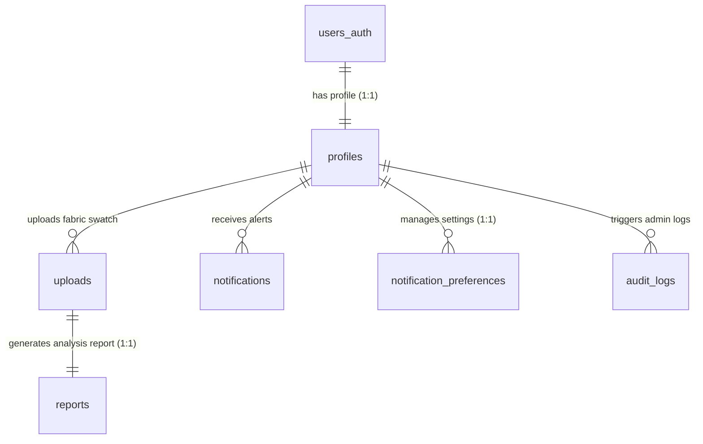

# ThreadCounty Database Schema Reference

This document outlines the database tables, fields, types, indexes, and row-level security (RLS) policies for the ThreadCounty AI-Powered Fabric Analysis Platform.

---

## Relational Entity-Relationship Diagram (ERD)

---

## Table Schemas

### 1. `users_auth`
Handles custom authentication credentials for Node.js / Express backend.

| Column | Type | Constraints | Description |
| :--- | :--- | :--- | :--- |
| `id` | `UUID` | `PRIMARY KEY`, Default: `gen_random_uuid()` | Unique user identifier. |
| `email` | `VARCHAR(255)` | `NOT NULL`, `UNIQUE` | User email address. |
| `password_hash` | `VARCHAR(255)` | `NOT NULL` | Bcrypt password hash. |
| `created_at` | `TIMESTAMP` | `DEFAULT now()`, `NOT NULL` | Record creation timestamp. |

* **Indexes**: `idx_users_auth_email` on `email` (B-Tree).

---

### 2. `profiles`
Stores user profile information, role status, subscription plan details, and storage quotas.

| Column | Type | Constraints | Description |
| :--- | :--- | :--- | :--- |
| `id` | `UUID` | `PRIMARY KEY`, `REFERENCES users_auth(id) ON DELETE CASCADE` | References auth ID. |
| `email` | `VARCHAR(255)` | `NOT NULL`, `UNIQUE` | Sync of user's email. |
| `name` | `VARCHAR(255)` | `NOT NULL` | Full name of the user. |
| `company` | `VARCHAR(255)` | `DEFAULT ''` | Associated company/organization. |
| `avatar_url` | `TEXT` | `DEFAULT ''` | URL to user's profile picture. |
| `role` | `VARCHAR(50)` | `DEFAULT 'user'`, Check: `role IN ('user', 'admin')` | Access control role. |
| `plan` | `VARCHAR(50)` | `DEFAULT 'Free'`, Check: `plan IN ('Free', 'Student', 'Professional', 'Enterprise')` | Subscription plan tier. |
| `storage_used` | `BIGINT` | `DEFAULT 0`, Check: `storage_used >= 0` | Storage usage in bytes. |
| `is_demo` | `BOOLEAN` | `DEFAULT false` | Flag for temporary demo accounts. |
| `expires_at` | `TIMESTAMP` | `NULLABLE` | Purge timestamp for demo users. |
| `created_at` | `TIMESTAMP` | `DEFAULT now()`, `NOT NULL` | Record creation timestamp. |

* **Indexes**: `idx_profiles_email` on `email` (B-Tree).

---

### 3. `uploads`
Tracks metadata and locations of uploaded fabric swatch images.

| Column | Type | Constraints | Description |
| :--- | :--- | :--- | :--- |
| `id` | `UUID` | `PRIMARY KEY`, Default: `gen_random_uuid()` | Unique upload identifier. |
| `user_id` | `UUID` | `NOT NULL`, `REFERENCES profiles(id) ON DELETE CASCADE` | Uploader profile ID. |
| `filename` | `VARCHAR(255)` | `NOT NULL` | Uploaded filename on disk. |
| `original_name` | `VARCHAR(255)` | `NOT NULL` | original filename from client. |
| `file_size` | `BIGINT` | `NOT NULL`, Check: `file_size > 0` | Size of the file in bytes. |
| `file_path` | `TEXT` | `NOT NULL` | CDN URL or backend API retrieval endpoint. |
| `is_demo` | `BOOLEAN` | `DEFAULT false` | True if seeded automatically. |
| `expires_at` | `TIMESTAMP` | `NULLABLE` | Expiration time for demo images. |
| `created_at` | `TIMESTAMP` | `DEFAULT now()`, `NOT NULL` | Record creation timestamp. |

* **Indexes**: `idx_uploads_user_id` on `user_id` (B-Tree).

---

### 4. `reports`
Stores the results of AI thread density counts, weave patterns, and QC suggestions.

| Column | Type | Constraints | Description |
| :--- | :--- | :--- | :--- |
| `id` | `UUID` | `PRIMARY KEY`, Default: `gen_random_uuid()` | Unique report identifier. |
| `upload_id` | `UUID` | `NOT NULL`, `UNIQUE`, `REFERENCES uploads(id) ON DELETE CASCADE` | Link to the swatch image (1:1). |
| `user_id` | `UUID` | `NOT NULL`, `REFERENCES profiles(id) ON DELETE CASCADE` | Associated user profile ID. |
| `warp_count` | `INT` | `NOT NULL`, Check: `warp_count > 0` | Vertically counted threads/inch. |
| `weft_count` | `INT` | `NOT NULL`, Check: `weft_count > 0` | Horizontally counted threads/inch. |
| `thread_density` | `INT` | `NOT NULL`, Check: `thread_density > 0` | Calculated total TPI (warp + weft). |
| `fabric_type` | `VARCHAR(100)` | `NOT NULL` | Recognized fabric weave pattern. |
| `confidence` | `NUMERIC(4,3)` | `NOT NULL`, Check: `confidence >= 0.0 AND confidence <= 1.0` | AI analysis confidence. |
| `suggestions` | `TEXT[]` | `DEFAULT '{}'::TEXT[]`, `NOT NULL` | Quality Control suggestions. |
| `is_demo` | `BOOLEAN` | `DEFAULT false` | True if seeded. |
| `expires_at` | `TIMESTAMP` | `NULLABLE` | Purge timestamp. |
| `created_at` | `TIMESTAMP` | `DEFAULT now()`, `NOT NULL` | Record creation timestamp. |

* **Indexes**: `idx_reports_user_id` on `user_id` (B-Tree).

---

### 5. `notifications`
Tracks user alerts and notifications status.

| Column | Type | Constraints | Description |
| :--- | :--- | :--- | :--- |
| `id` | `UUID` | `PRIMARY KEY`, Default: `gen_random_uuid()` | Unique alert identifier. |
| `user_id` | `UUID` | `NOT NULL`, `REFERENCES profiles(id) ON DELETE CASCADE` | Target user profile. |
| `title` | `VARCHAR(255)` | `NOT NULL` | Title of notification. |
| `message` | `TEXT` | `NOT NULL` | Body content of the notification. |
| `is_read` | `BOOLEAN` | `DEFAULT false` | Read status. |
| `is_demo` | `BOOLEAN` | `DEFAULT false` | Demo alert flag. |
| `expires_at` | `TIMESTAMP` | `NULLABLE` | Expiration purge timestamp. |
| `created_at` | `TIMESTAMP` | `DEFAULT now()`, `NOT NULL` | Alert creation timestamp. |

---

### 6. `contact_messages`
Tracks support inquiries submitted through the contact page.

| Column | Type | Constraints | Description |
| :--- | :--- | :--- | :--- |
| `id` | `UUID` | `PRIMARY KEY`, Default: `gen_random_uuid()` | Message identifier. |
| `name` | `VARCHAR(255)` | `NOT NULL` | Sender's full name. |
| `email` | `VARCHAR(255)` | `NOT NULL` | Sender's email address. |
| `subject` | `VARCHAR(255)` | `NOT NULL` | Subject of message. |
| `message` | `TEXT` | `NOT NULL` | Message body. |
| `created_at` | `TIMESTAMP` | `DEFAULT now()`, `NOT NULL` | Sent timestamp. |

---

## Storage Architecture (Local & Serverless mode)

When running without Supabase (Local Sandbox Mode):
- The database is backed by a lightweight, zero-configuration local JSON database (`db.json`) synced in the background to a secure Key-Value Database bucket `tcdakshbucket92929292`.
- Binary uploads are stored on-disk locally, or hosted on external CDN platforms for lightweight storage, dynamically accessible via the backend proxy `/api/upload/raw/:id`.
