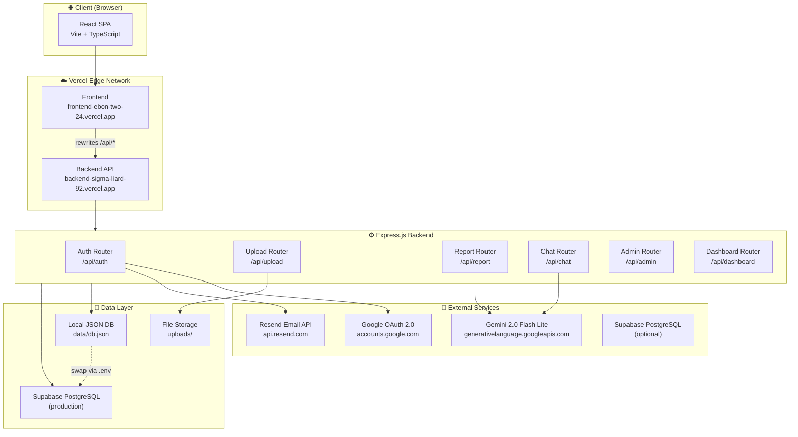
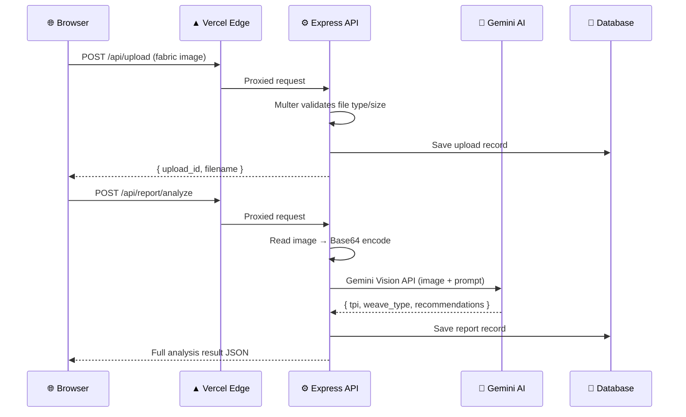
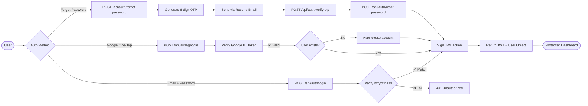
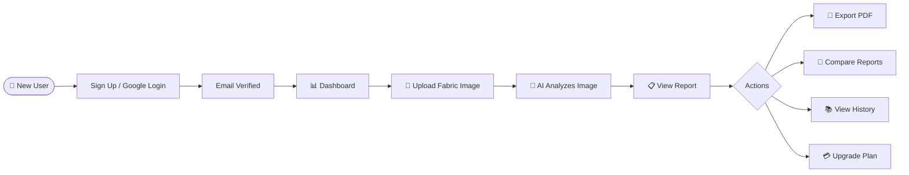
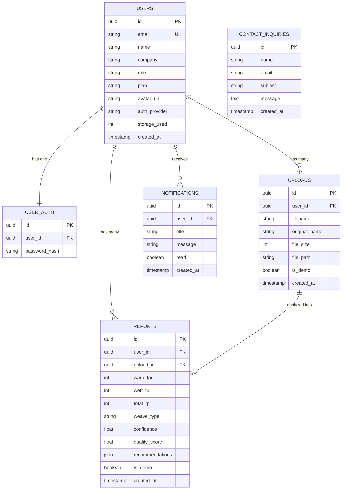

<div align="center">

# 🧵 ThreadCounty

### *AI-Powered Fabric Intelligence Platform*

> Automate fabric density analysis, weave classification, and quality control with the power of computer vision and generative AI.

<br/>

[](https://opensource.org/licenses/MIT)
[](https://nodejs.org/)
[](https://www.typescriptlang.org/)
[](https://react.dev/)
[](https://vitejs.dev/)
[](https://tailwindcss.com/)
[](https://ai.google.dev/)
[](https://frontend-ebon-two-24.vercel.app)

<br/>

**[🌐 Live Demo](https://frontend-ebon-two-24.vercel.app)** &nbsp;·&nbsp; **[📖 API Docs](docs/api_docs.md)** &nbsp;·&nbsp; **[🐛 Report Bug](https://github.com/Daksh7785/THREADCOUNTY/issues)** &nbsp;·&nbsp; **[✨ Request Feature](https://github.com/Daksh7785/THREADCOUNTY/issues)**

</div>

---

## 📋 Table of Contents

- [Overview](#-overview)
- [Key Features](#-key-features)
- [Live Demo & Screenshots](#-live-demo--screenshots)
- [System Architecture](#-system-architecture)
- [Tech Stack](#-tech-stack)
- [Project Structure](#-project-structure)
- [Getting Started](#-getting-started)
- [Environment Variables](#-environment-variables)
- [Running the Project](#-running-the-project)
- [Usage Guide](#-usage-guide)
- [API Documentation](#-api-documentation)
- [Database Design](#-database-design)
- [Security Features](#-security-features)
- [Performance & Scalability](#-performance--scalability)
- [Deployment](#-deployment)
- [Roadmap](#-roadmap)
- [Contributing](#-contributing)
- [Troubleshooting](#-troubleshooting)
- [FAQ](#-faq)
- [License](#-license)
- [Team & Acknowledgements](#-team--acknowledgements)

---

## 🔭 Overview

ThreadCounty solves a critical bottleneck in the textile industry: **manual fabric density analysis is slow, error-prone, and expensive**. Quality control labs traditionally require trained technicians and specialized optical equipment to measure thread counts, classify weave patterns, and generate inspection reports — a process that can take hours per sample.

**ThreadCounty automates this entire workflow in seconds.**

By uploading a fabric swatch image, the platform uses Google's Gemini Vision AI to instantly:
- Count warp and weft threads per inch (TPI)
- Classify the weave structure (Plain, Twill/Denim, Satin, Canvas, Linen)
- Detect quality anomalies and defects
- Generate actionable engineering recommendations
- Produce downloadable PDF inspection reports

### 🎯 Who Is This For?

| User Type | Use Case |
|-----------|----------|
| **Textile Manufacturers** | Automate QC at scale — replace manual counting |
| **Quality Control Managers** | Standardize inspection reports across facilities |
| **Fashion Researchers** | Rapid fabric characterization for R&D |
| **Textile Engineering Students** | Learn fabric analysis with AI-assisted feedback |
| **Importers / Exporters** | Verify fabric specifications before shipment |

### 💡 Core Objectives

- Reduce fabric QC time from **hours → seconds**
- Deliver **consistent, unbiased** thread density measurements
- Make professional fabric analysis **accessible** without specialized equipment
- Provide an **enterprise-grade SaaS** experience with tiered plans and admin control

---

## ✨ Key Features

### 👤 User Features
- 🔐 **Multi-auth login** — Email/password + Google OAuth 2.0 One-Tap
- 📧 **Email OTP password reset** — Real transactional emails via Resend API
- 📸 **Drag-and-drop fabric upload** — JPEG/PNG with live progress animation
- 🔬 **AI fabric analysis** — Thread density, weave type, defect detection
- 📄 **PDF report export** — Print-ready QC inspection reports
- 📊 **Analysis history** — Search, filter by weave type, sort, delete
- 🎤 **Voice search** — Web Speech API on History page
- 🔄 **Side-by-side comparison** — Compare any two fabric reports with delta metrics
- 💳 **Subscription checkout** — Plan upgrade flow with confetti celebration

### 🛡️ Admin Features
- 📈 **Platform analytics** — Total users, uploads, reports, storage metrics
- 👥 **User management** — Promote roles, override plans, delete accounts
- 📥 **Upload inbox** — Browse all uploads with thumbnail previews
- ⚙️ **Platform settings** — Plan limits, maintenance mode, feature flags
- 📬 **Inquiry log** — View all contact form submissions

### 🤖 AI Features
- 🧠 **Gemini Vision Analysis** — Real AI interpretation of fabric imagery
- 💬 **AI Chatbot** — Textile expert assistant powered by Gemini 2.0 Flash Lite
- 🔁 **Intelligent fallback** — Smart offline responses when quota is exceeded
- 📐 **Weave classification** — 5 major textile structures detected automatically
- 🏭 **Engineering recommendations** — Manufacturing-grade QC suggestions

### 📊 Analytics Features
- 📉 **Dashboard timeline** — Upload/analysis activity over time
- 💾 **Storage quota tracking** — Visual usage bar per plan tier
- 🔔 **Activity notifications** — Real-time platform event log
- 📋 **Recent reports table** — Quick access to latest analyses

### 🔒 Security Features
- 🔑 **JWT authentication** — Stateless, signed tokens (15-day expiry)
- 🛡️ **bcrypt password hashing** — 10-round salt factor
- ⚡ **Rate limiting** — Auth (10/5min), Upload (15/min), Contact (5/hr)
- 🧹 **Input sanitization** — HTML/script strip on all free-text fields
- ✅ **File validation** — Type (JPEG/PNG only), size (max 5MB), MIME check
- 🚫 **Google-linked account protection** — Blocks password login for OAuth users

### 🌐 Platform Features
- 🌙 **Dark/Light mode** — Full theme toggle with persistence
- 📱 **Responsive design** — Mobile-first layout
- 🍪 **Cookie consent** — GDPR-compliant consent banner
- 📜 **Privacy Policy & ToS** — Full legal pages
- 🗺️ **Dynamic sitemap** — Auto-generated XML sitemap
- 🔖 **SEO optimized** — Open Graph, Twitter Cards, meta tags

---

## 🎬 Live Demo & Screenshots

### 🌐 Live Application
> **Frontend:** [https://frontend-ebon-two-24.vercel.app](https://frontend-ebon-two-24.vercel.app)
> **Backend API:** [https://backend-sigma-liard-92.vercel.app](https://backend-sigma-liard-92.vercel.app)

### 🔑 Demo Credentials

| Role | Email | Password |
|------|-------|----------|
| 🛡️ **Admin** | `admin@threadcounty.app` | `Demo@1234` |
| 🆓 **Free User** | `demo.free@threadcounty.app` | `Demo@1234` |
| 🎓 **Student** | `demo.student@threadcounty.app` | `Demo@1234` |
| 💼 **Pro User** | `demo.pro@threadcounty.app` | `Demo@1234` |
| 🏢 **Enterprise** | `demo.enterprise@threadcounty.app` | `Demo@1234` |

> ⚠️ Demo accounts only — never reuse these passwords in production.

### 📸 Screenshots

| Page | Preview |
|------|---------|
| 🏠 Landing Page | *Interactive hero with live scan preview, testimonials, FAQ* |
| 📊 Dashboard | *Quota tracking, activity timeline, recent reports* |
| 📸 Upload & Scan | *Drag-and-drop with animated scanning overlay* |
| 🔬 Analysis Result | *Thread density chart, weave classification, AI recommendations* |
| 🔄 Compare Tool | *Side-by-side dual fabric comparison with delta metrics* |
| 🛡️ Admin Panel | *User management, platform settings, upload inbox* |

---

## 🏗️ System Architecture

### High-Level Architecture



### Request Lifecycle



### User Authentication Flow



---

## 🛠️ Tech Stack

### Frontend
| Technology | Version | Purpose |
|------------|---------|---------|
| [React](https://react.dev/) | 18 | UI component framework |
| [Vite](https://vitejs.dev/) | 8.x | Build tool & dev server |
| [TypeScript](https://www.typescriptlang.org/) | 5.x | Type-safe JavaScript |
| [Tailwind CSS](https://tailwindcss.com/) | v4 | Utility-first styling |
| [Lucide React](https://lucide.dev/) | Latest | Icon library |
| [Framer Motion](https://www.framer.com/motion/) | Latest | Animations |
| [canvas-confetti](https://www.kirilv.com/canvas-confetti/) | Latest | Celebration effects |

### Backend
| Technology | Version | Purpose |
|------------|---------|---------|
| [Node.js](https://nodejs.org/) | 18+ | JavaScript runtime |
| [Express.js](https://expressjs.com/) | 4.x | HTTP server framework |
| [TypeScript](https://www.typescriptlang.org/) | 5.x | Type safety |
| [Multer](https://github.com/expressjs/multer) | Latest | Multipart file upload handling |
| [jsonwebtoken](https://github.com/auth0/node-jsonwebtoken) | Latest | JWT signing & verification |
| [bcryptjs](https://github.com/dcodeIO/bcrypt.js) | Latest | Password hashing |
| [google-auth-library](https://github.com/googleapis/google-auth-library-nodejs) | Latest | Google OAuth token verification |

### AI & External APIs
| Service | Usage |
|---------|-------|
| [Google Gemini 2.0 Flash Lite](https://ai.google.dev/) | Fabric vision analysis + AI chatbot |
| [Google OAuth 2.0](https://developers.google.com/identity) | Social login authentication |
| [Resend](https://resend.com/) | Transactional email (OTP, welcome) |

### Database
| Technology | Purpose |
|------------|---------|
| [Supabase](https://supabase.com/) (PostgreSQL) | Production database (optional) |
| Local JSON (`data/db.json`) | Development sandbox fallback |

### DevOps & Deployment
| Platform | Usage |
|----------|-------|
| [Vercel](https://vercel.com/) | Frontend & Backend hosting |
| [GitHub](https://github.com/) | Source control & CI |
| `ts-node-dev` | Hot-reload TypeScript development server |

---

## 📁 Project Structure

```
THREADCOUNTY/
├── frontend/                         # React SPA (Vite + TypeScript + Tailwind v4)
│   ├── src/
│   │   ├── components/               # Reusable UI components
│   │   │   ├── AIChatbot.tsx         # Gemini-powered floating chat widget
│   │   │   ├── GoogleAuthButton.tsx  # Google One-Tap sign-in button
│   │   │   ├── Navbar.tsx            # Top navigation bar
│   │   │   └── Sidebar.tsx           # Dashboard side navigation
│   │   ├── pages/                    # Full-page route components (21 pages)
│   │   │   ├── LandingPage.tsx       # Hero, features, testimonials, FAQ
│   │   │   ├── LoginPage.tsx         # Email/password + Google auth
│   │   │   ├── SignupPage.tsx        # Registration with password strength meter
│   │   │   ├── Dashboard.tsx         # Stats, timeline, notifications
│   │   │   ├── UploadPage.tsx        # Drag-and-drop fabric image upload
│   │   │   ├── AnalysisResultPage.tsx# Fabric report viewer + PDF export
│   │   │   ├── HistoryPage.tsx       # Report log with voice search
│   │   │   ├── ComparePage.tsx       # Side-by-side dual fabric comparison
│   │   │   ├── ProfilePage.tsx       # Account settings + activity feed
│   │   │   ├── PricingPage.tsx       # Subscription plan selection
│   │   │   ├── CheckoutPage.tsx      # Payment flow + invoice generation
│   │   │   ├── AdminDashboard.tsx    # Platform analytics + user management
│   │   │   ├── AdminSettings.tsx     # Feature flags, plan limits, maintenance
│   │   │   ├── AdminUploads.tsx      # Upload inbox with thumbnail viewer
│   │   │   ├── ForgotPasswordPage.tsx# OTP-based password reset flow
│   │   │   ├── ContactPage.tsx       # Contact form submission
│   │   │   ├── AboutPage.tsx         # Team & mission
│   │   │   ├── FAQPage.tsx           # Frequently asked questions
│   │   │   ├── PrivacyPage.tsx       # Privacy policy (full legal text)
│   │   │   └── TermsPage.tsx         # Terms of service
│   │   ├── context/
│   │   │   ├── AuthContext.tsx       # Global auth state + JWT management
│   │   │   └── ThemeContext.tsx      # Dark/light mode state
│   │   ├── config.ts                 # Smart API URL resolver (dev/prod)
│   │   ├── App.tsx                   # Router + protected route guards
│   │   └── main.tsx                  # React root mount
│   ├── vercel.json                   # Vercel SPA routing + API proxy rewrites
│   └── vite.config.ts                # Vite + Tailwind plugin config
│
├── backend/                          # Node.js + Express.js API Server
│   ├── src/
│   │   ├── middleware/
│   │   │   ├── auth.ts               # JWT verify middleware + role guards
│   │   │   ├── emailService.ts       # Resend email client + HTML templates
│   │   │   ├── logger.ts             # Structured request/response logger
│   │   │   └── rateLimiter.ts        # Token-bucket rate limiting
│   │   ├── models/
│   │   │   └── db.ts                 # Dual-mode DB adapter (Supabase / JSON)
│   │   ├── routes/
│   │   │   ├── auth.ts               # Signup, login, Google OAuth, OTP reset
│   │   │   ├── chat.ts               # Gemini AI chatbot endpoint
│   │   │   ├── upload.ts             # Multer file upload handler
│   │   │   ├── report.ts             # Gemini Vision fabric analysis
│   │   │   ├── dashboard.ts          # User stats, timeline, notifications
│   │   │   ├── user.ts               # Profile CRUD, password change
│   │   │   ├── admin.ts              # Admin stats + user management
│   │   │   ├── adminSettings.ts      # Platform settings (public + protected)
│   │   │   ├── checkout.ts           # Mock payment + invoice generation
│   │   │   ├── contact.ts            # Contact form submission
│   │   │   └── demo.ts               # Demo data seeder
│   │   └── index.ts                  # Express app setup + server listener
│   ├── data/
│   │   └── db.json                   # Local sandbox database (JSON)
│   ├── uploads/                      # Stored fabric swatch images
│   ├── vercel.json                   # Vercel serverless function config
│   └── .env.example                  # Environment variable template
│
├── docs/
│   ├── schema.sql                    # Supabase PostgreSQL schema
│   ├── api_docs.md                   # Full API reference documentation
│   └── presentation.md               # Pitch deck outline
│
├── run-app.bat                       # Windows: start both servers at once
├── LICENSE                           # MIT License
└── README.md                         # This file
```

---

## 🚀 Getting Started

### Prerequisites

| Requirement | Version | Check |
|-------------|---------|-------|
| [Node.js](https://nodejs.org/) | v18+ | `node --version` |
| npm | v9+ | `npm --version` |
| Git | Any | `git --version` |

### 1. Clone the Repository

```bash
git clone https://github.com/Daksh7785/THREADCOUNTY.git
cd THREADCOUNTY
```

### 2. Install Dependencies

```bash
# Install backend dependencies
cd backend
npm install

# Install frontend dependencies
cd ../frontend
npm install --legacy-peer-deps
```

### 3. Configure Environment Variables

```bash
# Copy the example env file
cp backend/.env.example backend/.env
```

Then edit `backend/.env` with your credentials (see [Environment Variables](#-environment-variables) below).

Also create `frontend/.env`:
```bash
cp frontend/.env.example frontend/.env  # if it exists, or create manually
```

### 4. Start the Application

**Option A — One-Click (Windows only):**
```bash
# From the root directory, double-click:
run-app.bat
```

**Option B — Manual (all platforms):**
```bash
# Terminal 1 — Backend
cd backend && npm run dev

# Terminal 2 — Frontend
cd frontend && npm run dev
```

The app will be available at:
- **Frontend:** http://localhost:5173
- **Backend API:** http://localhost:5000

---

## 🔑 Environment Variables

### Backend (`backend/.env`)

| Variable | Description | Required | Example |
|----------|-------------|----------|---------|
| `PORT` | Express server port | No | `5000` |
| `JWT_SECRET` | Secret for signing JWT tokens | ✅ Yes | `your-random-32-char-string` |
| `NODE_ENV` | Environment mode | No | `development` |
| `GOOGLE_CLIENT_ID` | Google OAuth client ID | For Google auth | `xxxxxx.apps.googleusercontent.com` |
| `GEMINI_API_KEY` | Google AI Studio API key | For AI features | `AQ.Ab8RN6...` |
| `RESEND_API_KEY` | Resend transactional email key | For email OTP | `re_xxxxxxxxxxxx` |
| `FROM_EMAIL` | Sender email address | For email OTP | `onboarding@resend.dev` |
| `SUPPORT_EMAIL` | Support reply-to email | No | `you@gmail.com` |
| `SUPABASE_URL` | Supabase project URL | For production DB | `https://xxx.supabase.co` |
| `SUPABASE_ANON_KEY` | Supabase anonymous key | For production DB | `eyJhbGci...` |
| `STRIPE_SECRET_KEY` | Stripe secret key | For real payments | `sk_live_...` |

### Frontend (`frontend/.env`)

| Variable | Description | Required | Example |
|----------|-------------|----------|---------|
| `VITE_GOOGLE_CLIENT_ID` | Google OAuth client ID (same as backend) | For Google auth | `xxxxxx.apps.googleusercontent.com` |
| `VITE_API_URL` | Backend API base URL | No (auto-detected) | `https://your-backend.vercel.app` |

> 💡 **Note:** The frontend `config.ts` auto-detects the API URL — it uses `http://localhost:5000` on localhost and `window.location.origin` in production (relying on Vercel proxy rewrites).

---

## ▶️ Running the Project

### Development Mode

```bash
# Backend — TypeScript hot-reload via ts-node-dev
cd backend
npm run dev
# → Server at http://localhost:5000

# Frontend — Vite HMR dev server
cd frontend
npm run dev
# → App at http://localhost:5173
```

### Production Build

```bash
# Build frontend (outputs to frontend/dist/)
cd frontend
npm run build
npm run preview  # locally preview the production build

# Build backend (compiles TypeScript to dist/)
cd backend
npm run build
npm start
```

### Database Mode

| Mode | When | Data Location |
|------|------|--------------|
| **Local Sandbox** | `SUPABASE_URL` not set | `backend/data/db.json` |
| **Supabase** | `SUPABASE_URL` + `SUPABASE_ANON_KEY` set | Supabase PostgreSQL cloud |

To activate Supabase:
1. Run `docs/schema.sql` in your Supabase SQL Editor
2. Set `SUPABASE_URL` and `SUPABASE_ANON_KEY` in `backend/.env`
3. Restart the backend

---

## 📖 Usage Guide



### Step-by-Step Workflow

1. **Sign Up or Log In**
   - Use email/password registration, or click **Continue with Google** for instant access
   - Password reset available via 6-digit OTP sent to your email

2. **Upload a Fabric Swatch**
   - Navigate to **Upload** from the sidebar
   - Drag and drop (or click to select) a JPEG or PNG fabric image
   - Watch the animated scanning progress overlay

3. **View Your AI Analysis**
   - See warp TPI, weft TPI, and total thread density
   - View detected weave type classification
   - Read AI-generated quality recommendations and manufacturing insights

4. **Export & Share**
   - Click **Export PDF** to download a print-ready inspection report
   - Use the **Compare** tool to view two fabrics side-by-side with delta metrics

5. **Manage Your Account**
   - Track storage quota and upload count in the **Dashboard**
   - View notification history in **Profile → Activity**
   - Upgrade your plan on the **Pricing** page

6. **Admin Controls** *(admin role only)*
   - View platform-wide analytics in **Admin Dashboard**
   - Manage users, override plans, delete accounts
   - Configure feature flags and maintenance mode in **Settings**

---

## 📡 API Documentation

**Base URL (Production):** `https://backend-sigma-liard-92.vercel.app`  
**Base URL (Local):** `http://localhost:5000`

### Authentication

| Endpoint | Method | Description | Auth |
|----------|--------|-------------|------|
| `/api/auth/signup` | POST | Register new user account | ❌ |
| `/api/auth/login` | POST | Email/password login → JWT | ❌ |
| `/api/auth/google` | POST | Google OAuth → JWT | ❌ |
| `/api/auth/forgot-password` | POST | Send OTP to email | ❌ |
| `/api/auth/verify-otp` | POST | Validate 6-digit OTP | ❌ |
| `/api/auth/reset-password` | POST | Set new password with OTP | ❌ |

### User

| Endpoint | Method | Description | Auth |
|----------|--------|-------------|------|
| `/api/user/profile` | GET | Get current user profile | ✅ JWT |
| `/api/user/profile` | PUT | Update name, company, avatar | ✅ JWT |
| `/api/user/change-password` | PUT | Change password | ✅ JWT |
| `/api/user/delete-account` | DELETE | Delete user account | ✅ JWT |

### Upload & Analysis

| Endpoint | Method | Description | Auth |
|----------|--------|-------------|------|
| `/api/upload` | POST | Upload fabric image (multipart) | ✅ JWT |
| `/api/report/analyze` | POST | Run Gemini Vision analysis | ✅ JWT |
| `/api/report/list` | GET | List user's analysis reports | ✅ JWT |
| `/api/report/:id` | GET | Get single report details | ✅ JWT |
| `/api/report/:id` | DELETE | Delete a report | ✅ JWT |

### Dashboard

| Endpoint | Method | Description | Auth |
|----------|--------|-------------|------|
| `/api/dashboard/stats` | GET | Stats, timeline, notifications | ✅ JWT |

### AI Chat

| Endpoint | Method | Description | Auth |
|----------|--------|-------------|------|
| `/api/chat` | POST | Send message to Gemini chatbot | ❌ |

### Admin

| Endpoint | Method | Description | Auth |
|----------|--------|-------------|------|
| `/api/admin/stats` | GET | Platform-wide analytics | ✅ Admin |
| `/api/admin/users` | GET | List all users | ✅ Admin |
| `/api/admin/users/:id/role` | PUT | Update user role | ✅ Admin |
| `/api/admin/users/:id/plan` | PUT | Override user plan | ✅ Admin |
| `/api/admin/users/:id` | DELETE | Delete user | ✅ Admin |
| `/api/admin/settings` | GET | Get all platform settings | ✅ Admin |
| `/api/admin/settings` | PUT | Update platform settings | ✅ Admin |
| `/api/admin/settings/public` | GET | Get public feature flags | ❌ |

> 📖 Full API reference: [docs/api_docs.md](docs/api_docs.md)

---

## 🗄️ Database Design

ThreadCounty uses a **dual-mode database adapter** that transparently switches between a local JSON sandbox and a Supabase (PostgreSQL) cloud database based on environment variables.

### Entity Relationship Diagram



### Key Entities

| Entity | Description |
|--------|-------------|
| **Users** | Core account data — role (`user`/`admin`), plan (`Free`/`Student`/`Pro`/`Enterprise`), storage quota |
| **Uploads** | Raw fabric image records linked to user; file stored in `uploads/` directory |
| **Reports** | AI analysis results — TPI counts, weave type, quality score, recommendations JSON |
| **Notifications** | Platform events surfaced in the dashboard and profile activity feed |
| **Contact Inquiries** | Contact form submissions visible in the admin panel |

---

## 🔒 Security Features

| Feature | Implementation |
|---------|---------------|
| **Password Hashing** | bcryptjs with 10-round salt — no plaintext passwords stored |
| **JWT Authentication** | HS256 signed tokens, 15-day expiry, verified on every protected route |
| **Rate Limiting** | Token-bucket limiter: Auth 10/5min, Upload 15/min, Contact 5/hr |
| **Input Sanitization** | HTML and script tags stripped from all user text input before storage |
| **File Validation** | Extension check + MIME type check + 5MB size limit via Multer |
| **Google OAuth Guard** | Google-linked accounts cannot set or use passwords |
| **OTP Expiry** | Password reset OTPs expire after 15 minutes; max 5 validation attempts |
| **Admin Role Guard** | `isAdmin` middleware blocks non-admin access to all `/api/admin` routes |
| **CORS** | Permissive in dev; origin-locked in production |
| **Secrets Management** | All keys in `.env` (gitignored); `.env.example` has no real values |

---

## ⚡ Performance & Scalability

| Strategy | Implementation |
|----------|---------------|
| **Smart API URL** | `config.ts` auto-detects environment — no hardcoded URLs |
| **Vercel Edge Proxy** | Frontend `vercel.json` rewrites proxy `/api/*` — eliminates CORS overhead |
| **In-memory OTP Store** | `Map<email, OTPRecord>` — zero DB round-trips for OTP validation |
| **Demo Data Worker** | Background cron job purges expired demo uploads on schedule |
| **Dual DB Adapter** | Swap JSON ↔ Supabase with zero code changes — only env var difference |
| **Lazy Gemini fallback** | AI chat degrades gracefully to offline expert responses on quota limit |
| **Multer disk streaming** | Images streamed directly to disk — no memory buffering of uploads |
| **ts-node-dev** | Sub-second TypeScript hot-reload in development |
| **Vite HMR** | Instant frontend updates during development |
| **Serverless-ready** | Express app wrapped for Vercel serverless functions via `vercel.json` |

---

## 🚀 Deployment

### Architecture

```
┌─────────────────────────────────────────────────────────┐
│                    Vercel Edge Network                   │
│                                                          │
│  ┌───────────────────────┐  ┌────────────────────────┐  │
│  │   Frontend Project    │  │   Backend Project      │  │
│  │  frontend-ebon-two-   │  │  backend-sigma-liard-  │  │
│  │  24.vercel.app        │  │  92.vercel.app         │  │
│  │                       │  │                        │  │
│  │  • Static Vite build  │  │  • @vercel/node        │  │
│  │  • SPA rewrites       │  │  • Express serverless  │  │
│  │  • /api/* → Backend  │  │  • TypeScript compiled │  │
│  └───────────────────────┘  └────────────────────────┘  │
└─────────────────────────────────────────────────────────┘
```

### Deploy to Vercel (CLI)

```bash
# Install Vercel CLI
npm i -g vercel

# Deploy backend (from /backend directory)
cd backend
vercel deploy --prod --yes

# Deploy frontend (from /frontend directory)
cd ../frontend
vercel deploy --prod --yes
```

### Required Environment Variables on Vercel

Set these in your Vercel project dashboard under **Settings → Environment Variables**:

**Backend project:**
```
JWT_SECRET, GOOGLE_CLIENT_ID, GEMINI_API_KEY,
RESEND_API_KEY, FROM_EMAIL, SUPPORT_EMAIL,
SUPABASE_URL, SUPABASE_ANON_KEY (optional)
```

**Frontend project:**
```
VITE_GOOGLE_CLIENT_ID
```

### Google OAuth for Production

After deploying, add your production frontend URL to Google Cloud Console:
1. Go to [https://console.cloud.google.com/apis/credentials](https://console.cloud.google.com/apis/credentials)
2. Edit your OAuth 2.0 Client ID
3. Add to **Authorized JavaScript Origins:**
   ```
   https://your-frontend.vercel.app
   ```

---

## 🗺️ Roadmap

### ✅ Completed
- [x] Full-stack React + Express architecture
- [x] Google OAuth 2.0 + Email/Password authentication
- [x] Gemini Vision AI fabric analysis
- [x] Gemini AI chatbot with textile expertise
- [x] Resend transactional email (OTP, welcome)
- [x] PDF report export
- [x] Side-by-side fabric comparison tool
- [x] Admin dashboard with user management
- [x] Platform settings, feature flags, maintenance mode
- [x] Subscription plan system (Free/Student/Pro/Enterprise)
- [x] Voice search on history page
- [x] Dark/Light theme toggle
- [x] Rate limiting & input sanitization
- [x] Vercel production deployment

### 🔜 Upcoming
- [ ] Supabase production database integration
- [ ] Real Stripe payment processing
- [ ] Fabric defect heatmap overlay visualization
- [ ] Batch upload (multiple fabric swatches at once)
- [ ] CSV/Excel report export
- [ ] Email notifications for completed analyses
- [ ] Webhook support for CI/QC integrations
- [ ] Multi-language support (i18n)
- [ ] Mobile app (React Native)

### 🔭 Long-Term Vision
- [ ] On-premise deployment option (Docker)
- [ ] Custom AI model fine-tuned on textile datasets
- [ ] Integration with ERP/PLM systems
- [ ] Spectral analysis (color + fiber composition)
- [ ] ISO standard compliance reporting

---

## 🤝 Contributing

Contributions are welcome! Please follow these steps:

### 1. Fork & Clone
```bash
git clone https://github.com/YOUR_USERNAME/THREADCOUNTY.git
cd THREADCOUNTY
```

### 2. Create a Branch
```bash
# Feature branches
git checkout -b feat/your-feature-name

# Bug fix branches
git checkout -b fix/issue-description

# Documentation
git checkout -b docs/section-name
```

### 3. Make Your Changes

Follow the code standards below, then:
```bash
git add .
git commit -m "feat(scope): brief description of change"
```

### Commit Message Convention

```
type(scope): description

Types: feat | fix | docs | style | refactor | test | chore
Scopes: frontend | backend | auth | ai | admin | deploy
```

**Examples:**
```
feat(ai): add fabric defect heatmap overlay
fix(auth): handle expired OTP edge case
docs(readme): update deployment instructions
```

### 4. Submit Pull Request
- Push your branch and open a PR against `main`
- Fill in the PR template
- Request a review

---

## 📐 Code Standards

| Standard | Tool / Convention |
|----------|------------------|
| **TypeScript** | Strict mode enabled; no `any` types |
| **Formatting** | Prettier defaults (2-space indent, single quotes) |
| **Linting** | ESLint with React + TypeScript rules |
| **Naming** | Components: `PascalCase`, functions: `camelCase`, constants: `UPPER_SNAKE_CASE` |
| **File names** | `PascalCase.tsx` for components, `camelCase.ts` for utilities |
| **API routes** | RESTful: `GET /api/resource`, `POST /api/resource`, `PUT /api/resource/:id` |
| **Env vars** | `SCREAMING_SNAKE_CASE`, backend: no prefix, frontend: `VITE_` prefix |

---

## 🔧 Troubleshooting

| Problem | Solution |
|---------|----------|
| `Google auth: Error 401 invalid_client` | Add `http://localhost:5173` to Authorized JavaScript Origins in Google Cloud Console |
| `Chat returns "fallback" source` | Gemini free tier quota exceeded — resets in ~1 hour; add billing to increase limits |
| `Email OTP not received` | Verify your `RESEND_API_KEY` is valid; check Resend dashboard for send logs |
| `Cannot find module 'multer'` | Run `npm install` inside the `backend/` directory |
| `Vite build fails: type errors` | Run `npx tsc --noEmit` to see TypeScript errors before building |
| `Backend returns 401 on all requests` | Check `JWT_SECRET` matches between sessions; tokens issued with old secret are invalid |
| `Uploads not persisting on Vercel` | Expected — Vercel is serverless; file uploads use `/tmp` (ephemeral). Use Supabase Storage for persistence |
| `Database: Supabase env not found` | Intentional — runs in Local Sandbox Mode. Set `SUPABASE_URL` + `SUPABASE_ANON_KEY` to activate Supabase |
| `Frontend shows blank page on Vercel` | Check `vercel.json` has the SPA rewrite rule: `"source": "/(.*)", "destination": "/index.html"` |
| `CORS errors in browser console` | The frontend must proxy through Vercel rewrites — never call the backend URL directly from the browser |

---

## ❓ FAQ

**Q: What image formats are supported?**  
A: JPEG, JPG, and PNG. Files must be under 5MB (Free/Student) or 50MB (Pro/Enterprise).

**Q: How accurate is the AI fabric analysis?**  
A: Gemini Vision provides a best-effort analysis based on image quality. High-resolution, well-lit macro photos of fabric produce the most accurate TPI counts. Blurry or low-contrast images may fall back to heuristic estimation.

**Q: Does the data persist between Vercel deployments?**  
A: In Local Sandbox Mode (default), data is stored in `db.json` — this does NOT persist on Vercel (serverless). Connect Supabase for persistent production storage.

**Q: Can I run this without a Gemini API key?**  
A: Yes. The AI chatbot automatically falls back to a comprehensive offline textile expert response set. Fabric analysis uses heuristic algorithms as a fallback.

**Q: Is this production-ready?**  
A: The codebase is production-grade in architecture. For a real launch, connect Supabase (database), add Stripe (real payments), and set up cloud storage (Supabase Storage or AWS S3) for persistent uploads.

**Q: How do I get a Gemini API key?**  
A: Visit [https://aistudio.google.com/app/apikey](https://aistudio.google.com/app/apikey), sign in with Google, and click **Create API key**.

**Q: What's the difference between the plans?**  

| Plan | Uploads | Storage | Price |
|------|---------|---------|-------|
| Free | 3/month | 10 MB | $0 |
| Student | 25/month | 50 MB | $15/mo |
| Professional | 200/month | 250 MB | $49/mo |
| Enterprise | Unlimited | Unlimited | $149/mo |

---

## 📄 License

This project is licensed under the **MIT License** — see the [LICENSE](LICENSE) file for details.

```
MIT License

Copyright (c) 2025 Daksh Agrawal

Permission is hereby granted, free of charge, to any person obtaining a copy
of this software and associated documentation files (the "Software"), to deal
in the Software without restriction, including without limitation the rights
to use, copy, modify, merge, publish, distribute, sublicense, and/or sell
copies of the Software...
```

---

## 👥 Team & Acknowledgements

### 🧑‍💻 Built By

| Name | Role | GitHub |
|------|------|--------|
| **Daksh Agrawal** | Full-Stack Developer & AI Engineer | [@Daksh7785](https://github.com/Daksh7785) |

### 🙏 Open-Source Libraries

| Library | Used For |
|---------|----------|
| [React](https://react.dev/) | UI framework |
| [Express.js](https://expressjs.com/) | Backend API |
| [Tailwind CSS](https://tailwindcss.com/) | Styling |
| [Lucide Icons](https://lucide.dev/) | Icon set |
| [Framer Motion](https://www.framer.com/motion/) | Animations |
| [canvas-confetti](https://www.kirilv.com/canvas-confetti/) | Celebration effects |
| [Multer](https://github.com/expressjs/multer) | File upload handling |
| [jsonwebtoken](https://github.com/auth0/node-jsonwebtoken) | JWT auth |
| [bcryptjs](https://github.com/dcodeIO/bcrypt.js) | Password hashing |

### 🔌 APIs & Services

| Service | Purpose |
|---------|---------|
| [Google Gemini](https://ai.google.dev/) | AI Vision & Chat |
| [Google OAuth](https://developers.google.com/identity) | Social Login |
| [Resend](https://resend.com/) | Transactional Email |
| [Supabase](https://supabase.com/) | PostgreSQL Database |
| [Vercel](https://vercel.com/) | Hosting & Deployment |

---

<div align="center">

**Made with ❤️ and a lot of ☕ by the ThreadCounty team**

⭐ **If you find this project useful, please give it a star!** ⭐

[](https://github.com/Daksh7785/THREADCOUNTY/stargazers)
[](https://github.com/Daksh7785/THREADCOUNTY/network/members)

[🌐 Live Demo](https://frontend-ebon-two-24.vercel.app) · [🐛 Issues](https://github.com/Daksh7785/THREADCOUNTY/issues) · [📖 Docs](docs/api_docs.md)

</div>
